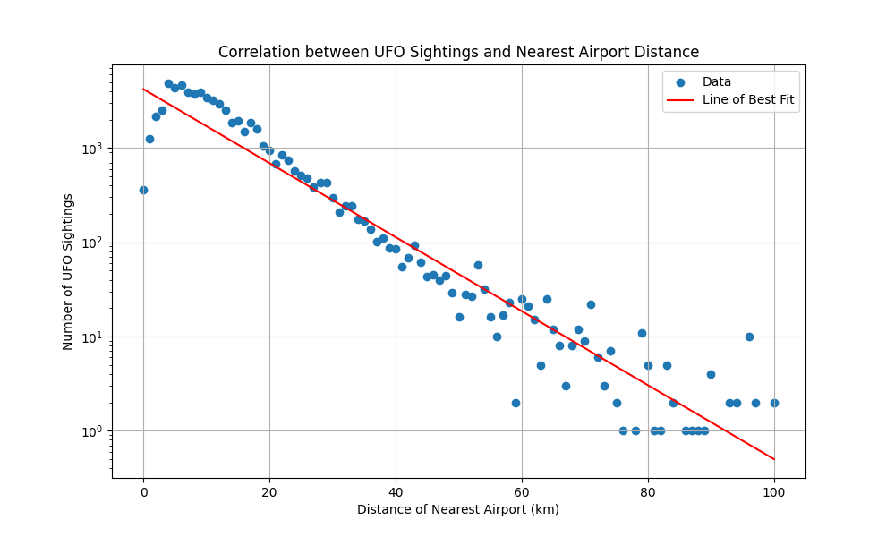

# UFO sightings data analysis and visualisation

I aimed for a clean and engaging visualization. You can view the final result above or in the `visualisation` folder.

## Data sources

- [UFO sightings](https://www.kaggle.com/datasets/jonwright13/ufo-sightings-around-the-world-better)
- [USA public airports](https://www.kaggle.com/datasets/nancyalaswad90/us-airports)
- [US States & Territories](http://goodcsv.com/geography/us-states-territories/)

## Do UFO sightings occur near airports?

- **Correlation Analysis:** A significant negative correlation was found between UFO sightings and the distance to the nearest airport, with a correlation coefficient of `r = -0.696`.

- **Linear Regression Analysis:** The relationship between the number of UFO sightings and the distance from the nearest airport resulted in the following equation:

  `log(Number of UFO sightings) = 8.3472 - 0.0904 * Distance from the nearest airport`

### Data distribution

A significant portion of UFO sightings occurred close to airports.

| Distance from Airport | Percentile of UFO Sightings |
| --------------------- | --------------------------- |
| 5 km                  | 21.76%                      |
| 10 km                 | 53.70%                      |
| 15 km                 | 74.54%                      |
| 20 km                 | 86.55%                      |
| 25 km                 | 92.36%                      |
| 30 km                 | 95.77%                      |

The distribution shows a clear trend, which is relevant considering the average distance people live from the nearest public airport in the USA is 41.39 km [[1]](https://mark-pearson.com/airport-distances/). If the average distance between airports were much shorter, most sightings would occur close to airports.

### Data Distribution within the First 5 km from Airports

Within the first 5 km from airports, an interesting pattern emerges where the number of sightings initially increases and then starts to decrease after the fifth kilometer, exhibiting an almost perfect correlation for the next 35 km. This phenomenon could be explained by the lack of residential areas near airports, leading to fewer UFO sightings reported. However, this is only a hypothesis and could be subject to further analysis and research.
